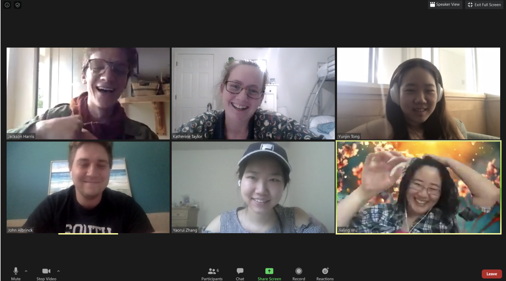
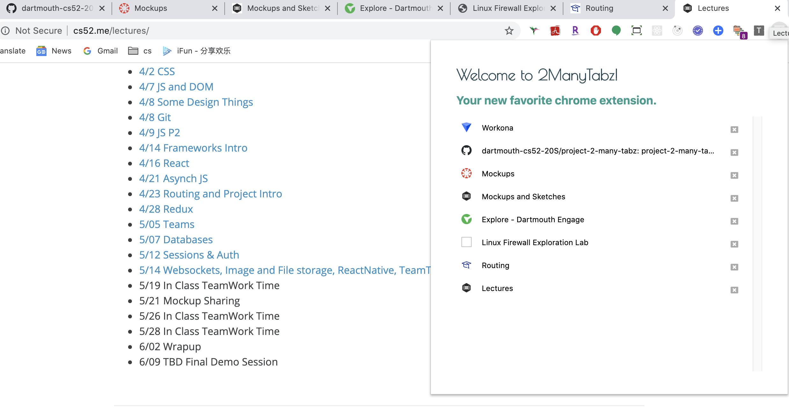
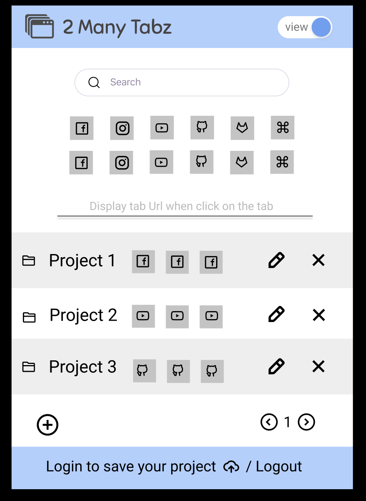
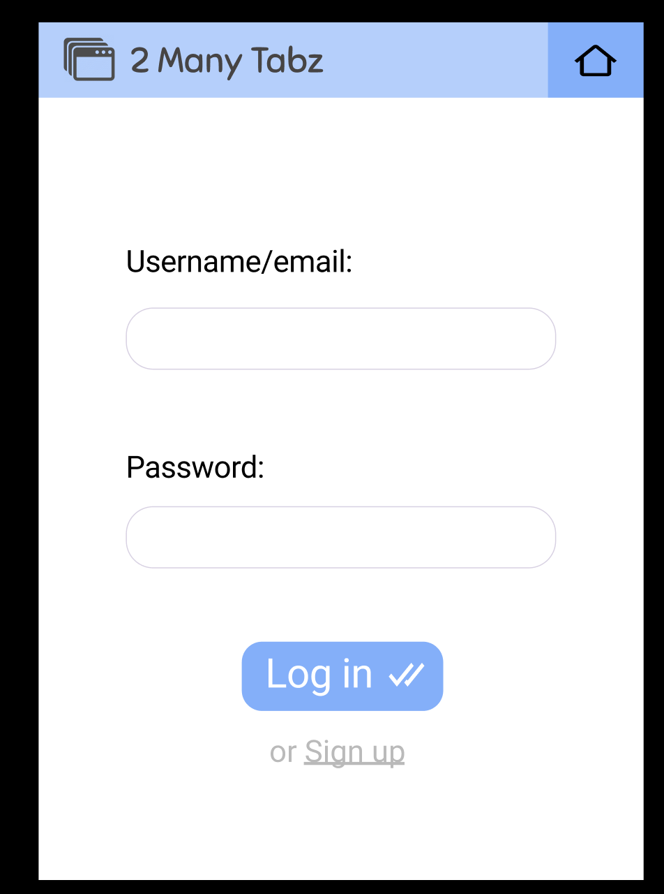
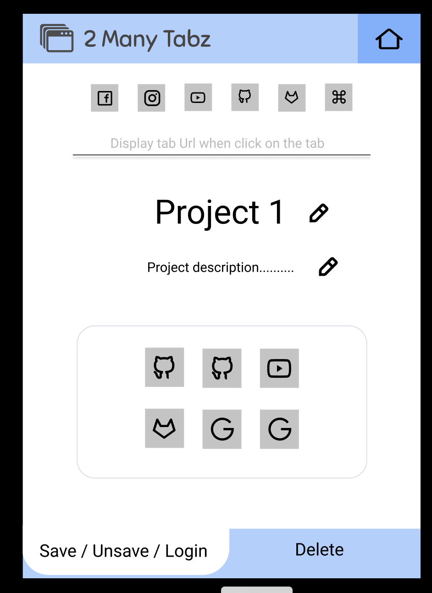
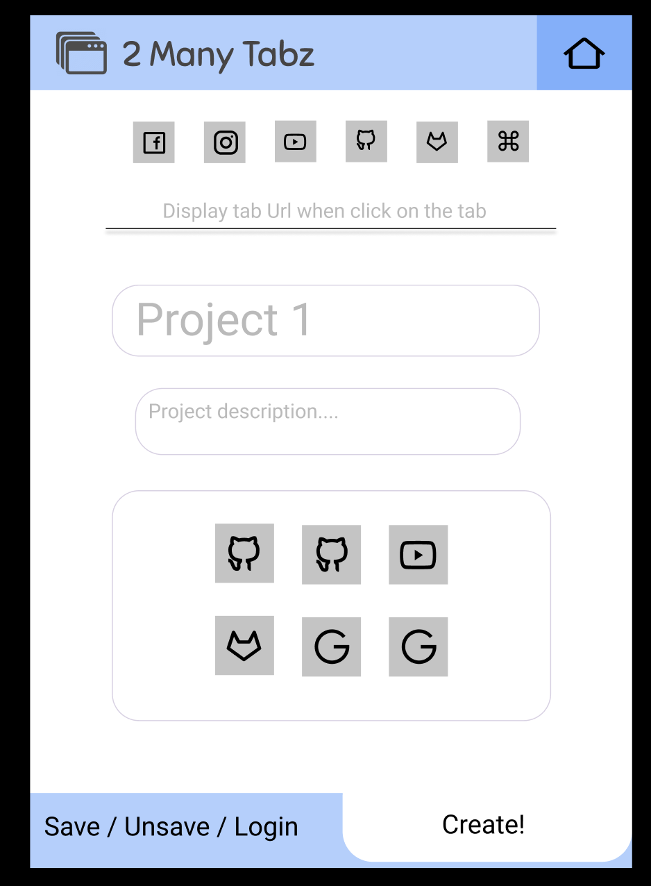
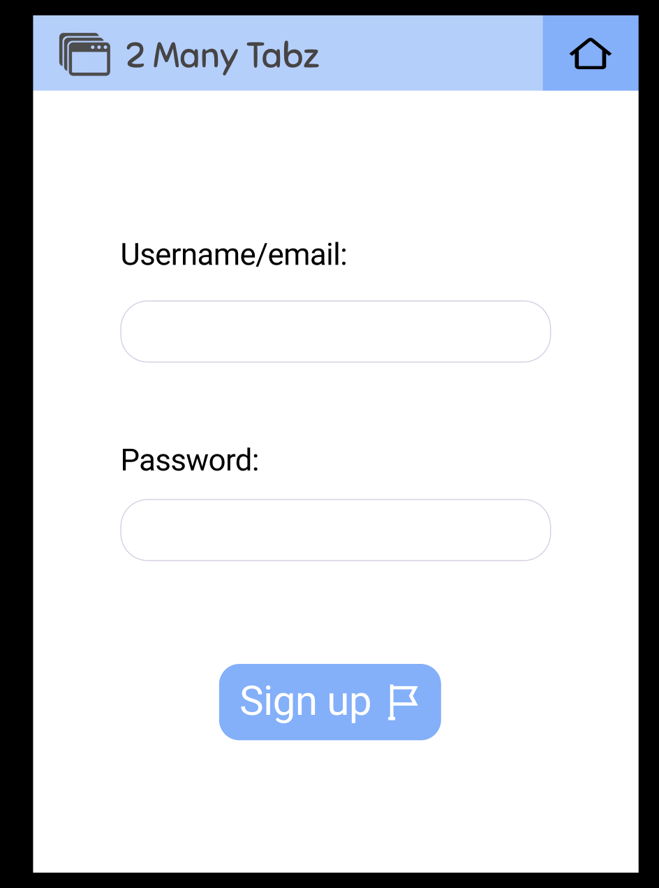
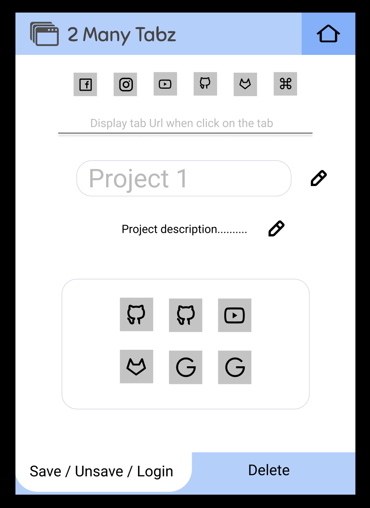
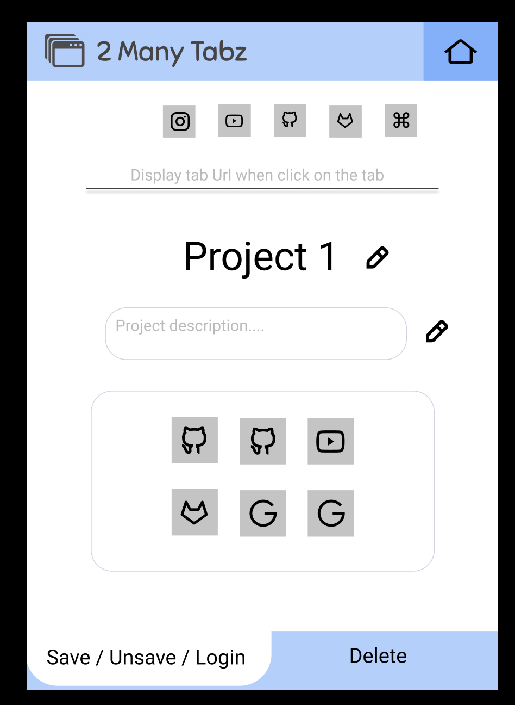
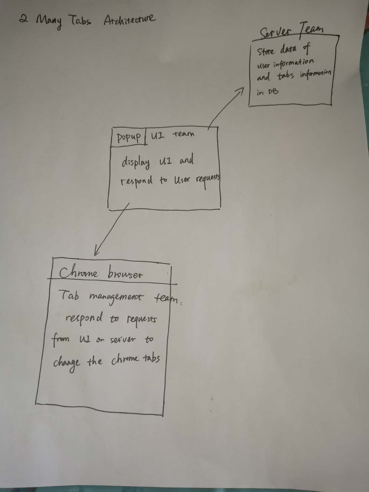

# 2 Many Tabz

[*how?*](https://help.github.com/articles/about-readmes/#relative-links-and-image-paths-in-readme-files)

TODO: short project description, some sample screenshots or mockups

## Work flow and updates
5.19 update( A prototype):

5.20 MockUp(UI design)

## Architecture

In this part, we will explain how did our team split things up and collaborate with each other.

In general, we have three teams each working on a specific task.

### Team 1: UI team
Members: Katherine Taylor, Yunjin Tong（Jackson Harris）

Responsibility: 
* design popup UI (finished)
* implement the popup interface
* cooperate with the other 2 teams.

### Team 2: Tab management team
Members: Yaorui Zhang, Jialing Wu

Responsibility:
* offer tab management api methods(basically developed from chrome.tabs)
* interact with all the tab changes in the chrome browser
* offer tab information to the server team and UI team
* There are five methods that can be leveraged by the UI and Server teams.

#### Methods we've implemented:
1. list all the tabs information in the browser(this method is offered for the UI team).
2. jump to method: if you click the tab, it will direct to the corresponding tab in the chrome(this method is offered for the UI team)
3. close method: delete tabs you don't want(this method is offered for the UI team)
4. open tab: facilitate the history data to be opened in the chrome browser. In general, The history data are stored in different project folders, each time we want to open one tab, this method can help open the current tab in the chrome browser(this method is for the server team and UI team).
5. open tabs: this method is also for the server team. This method can opens all the tabs in one project folder(this method is for the server team and UI team).

### Team 3: Server team
Members: Nathan Albrinck, Jackson Harris

Responsibility:
* User Auth
* Database
* collaborate with the other teams

### Front-end: 
 * Welcome...
 * A button for history
     * Could open new tab altogether
 * A button for project folders
     * Button for view change / straightforward UI
     * List (grid view?) of Tabs in this project
         * Icon
         * URL
         * Title
         * Tags/description
         * Importance?
     * delete button
     * search button (specific tab or tags)
 * Div of options for this particular tab...
     * Add to database (specify options)
     
### Back-end: 
 * Tab Model
     * Opened At
     * URL
     * Name
     * Tags 
     * Custom Notes
 * Project/Folder Model
     * Name
     * List of tabs
     * Custom Notes
 * User model?
     * Definitely don't want on front-end, should be able to derive info from computer/browser..

TODO:  descriptions of code organization and tools and libraries used

## Setup
Because this is an extension, prior to publication on the Chrome webstore, users need to do a teeny bit of work to view the extension for themselves (as opposed to having an already-hosted web application).
* First, make sure to clone this repo with `git clone https://github.com/dartmouth-cs52-20S/project-2-many-tabz.git` in a directory of your choice. 
* Next, simply fire up Chrome and navigate to [chrome://extensions/](chrome://extensions/). 
* Ensure Developer Mode is activated (click the radio button at the top right of this page).
* Click the Load Unpacked button, and select the /src folder of this github repository.
* Turn on the extension by clicking the blue radio button at the bottom right corner of the extension box.
* Click the refresh icon on the extension box anytime you pull a new update from this repository.

## Deployment
Once you've finished the above, just click the new 2ManyTabs icon in your chrome window to pull up our beauiful UI and interact with the app!

## Authors
* Yaorui Zhang
* Jialing Wu
* Katherine Taylor
* Jackson Harris
* Nathan Albrinck
* Yunjin Tong
  
## Acknowledgments
